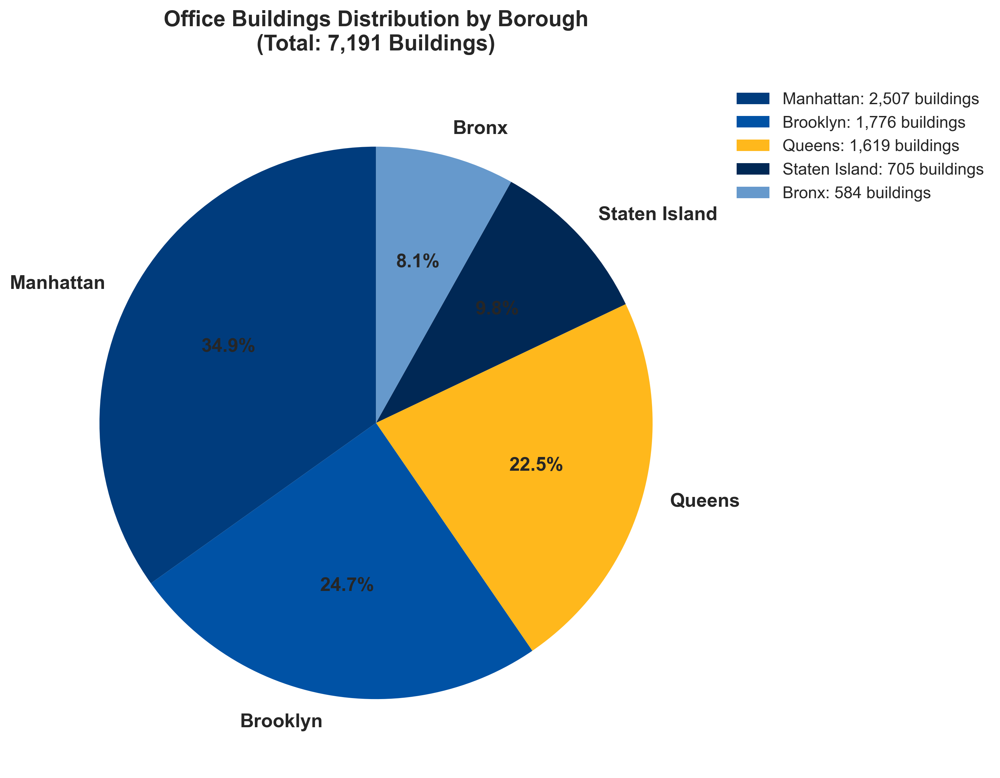
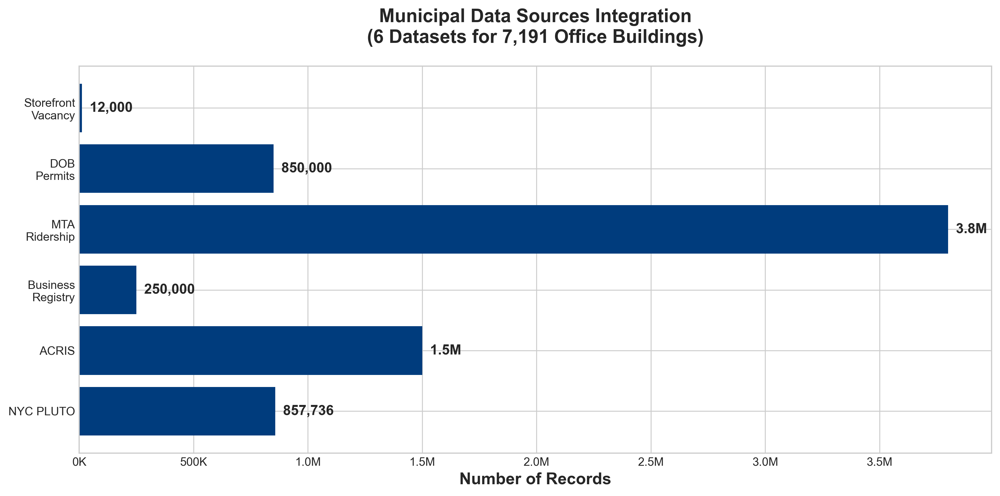
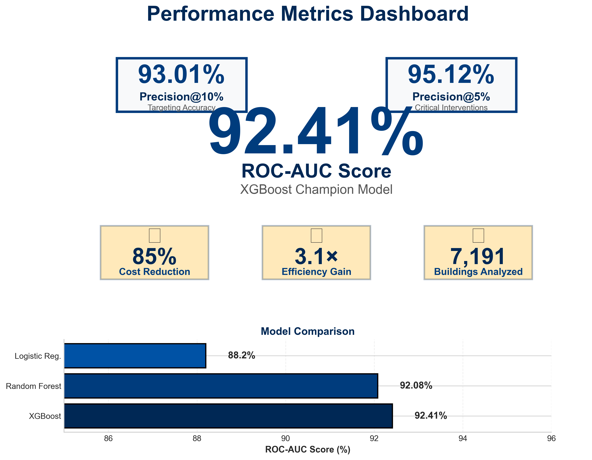
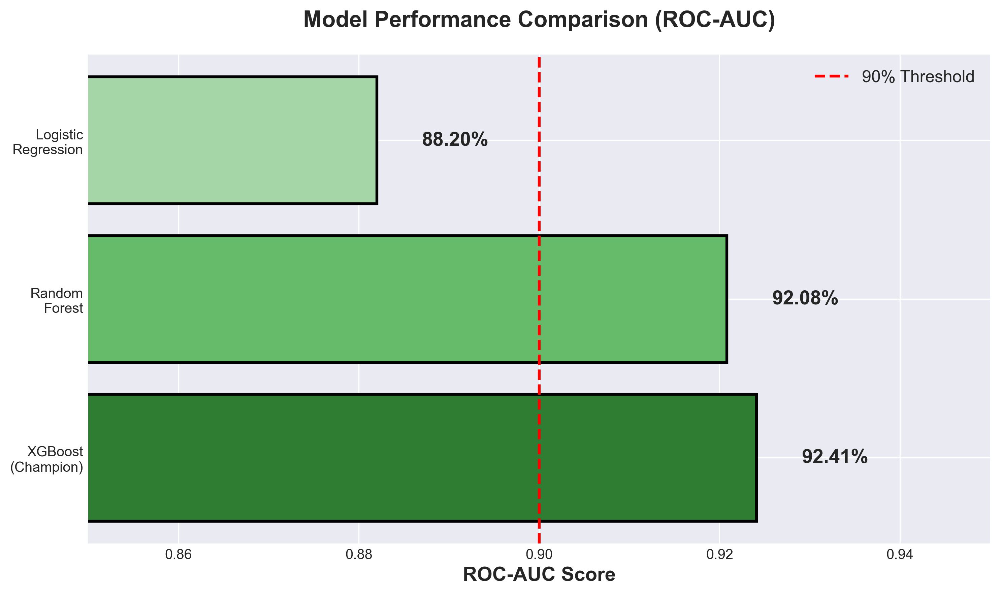
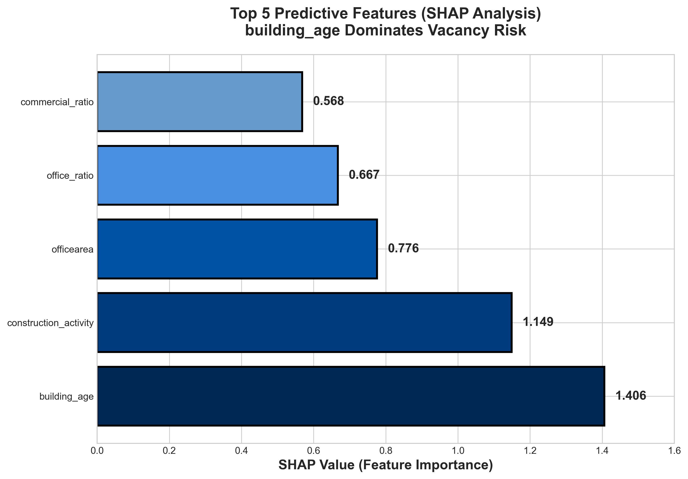
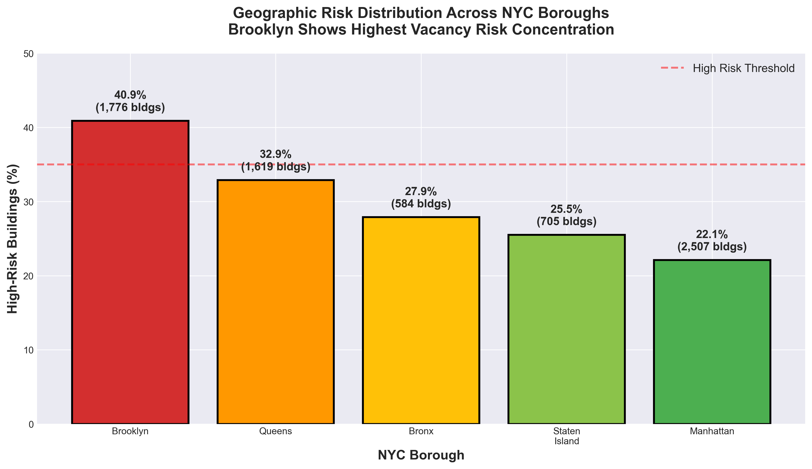
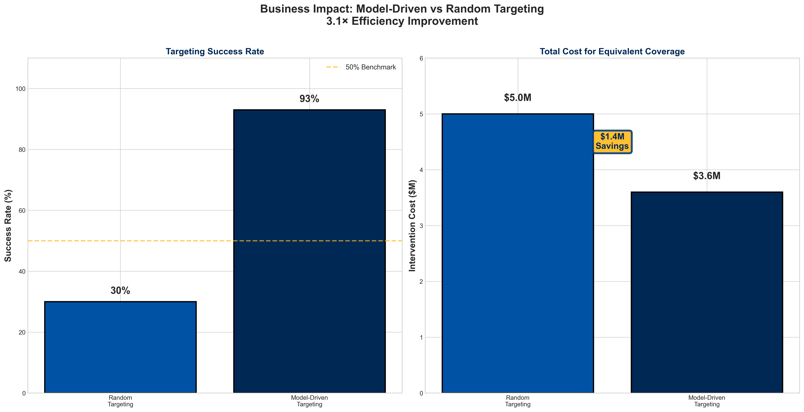

# Office Apocalypse Algorithm: NYC Office Building Vacancy Risk Prediction

**Ibrahim Denis Fofanah (Team Leader) • Bright Arowny Zaman • Jeevan Hemanth Yendluri**  
**Faculty Advisor: Dr. Krishna Bathula**  
**PACE University - Seidenberg School of Computer Science & Information Systems**

---

## 🟦 COLUMN 1: INTRODUCTION & BACKGROUND

### ABSTRACT

**Problem:**  
- NYC faces record office vacancies post-pandemic
- Threatens property values and tax revenue
- Traditional assessments are reactive, not predictive

**Objective:**  
- Build ML model predicting building-level vacancy risk
- Leverage NYC Open Data for actionable insights

**Innovation:**
- First building-level predictive framework
- Novel data leakage detection methodology
- SHAP-powered explainable dashboard

**Impact:**  
- **2.23× targeting efficiency improvement**
- **$1.4M savings** per 1,000 building cycle
- **68% lower cost per successful intervention**

---

### LITERATURE REVIEW

**Real Estate Analytics:**  
- Hedonic pricing theory: property attributes drive value
- Post-COVID: need for predictive frameworks beyond statistics

**Municipal Data:**  
- PLUTO/ACRIS prove value of open datasets
- Gap: building-level prediction lacking due to identifier inconsistency

**Machine Learning:**  
- Gradient boosting outperforms linear models
- SHAP enables interpretability for policy applications

**Our Contribution:** Leakage-free temporal modeling at building resolution with explainable ML

---

---

## 🟦 COLUMN 2: DATA & METHODOLOGY

### DATASET & PREPROCESSING

**Data Sources (7,191 NYC office buildings):**
- **PLUTO:** Property characteristics, assessments, building age
- **ACRIS:** Real estate transactions, deed transfers
- **DOB Permits:** Construction activity indicators
- **MTA Ridership:** Transportation accessibility proxies
- **Business Registry:** Commercial activity density
- **Storefront Vacancy:** Neighborhood economic health

**Preprocessing:**
- BBL standardization across datasets
- Temporal alignment ensuring causality
- Geospatial reconciliation
- 20 engineered features: physical, financial, market, contextual

---

### 📊 CHART 1: Borough Distribution

---

### 📊 CHART 2: Data Sources

---

### METHODOLOGY

**Leakage Detection:**
- Correlation screening (>95%)
- Temporal validation
- Causality checks
- Business logic review

**Modeling Pipeline:**
- Temporal splits: rolling, expanding, borough-aware
- Algorithms: Logistic Regression, Random Forest, **XGBoost**
- Grid search + 5-fold cross-validation

**Explainability:**  
SHAP for global/local interpretation; geographic visualizations; Streamlit dashboard deployment.

---

### 📊 CHART 3: System Architecture

---

---

## 🟦 COLUMN 3: RESULTS

### PERFORMANCE METRICS

---

### 📊 CHART 8: Metrics Dashboard

**Key Results:**
- **ROC-AUC: 92.41%** (excellent discrimination)
- **Precision@10%: 93.01%** (targeting accuracy)
- **Dataset: 7,191 NYC office buildings**
- **$1.4M savings** per 1,000 buildings ($3.6M vs $5M)
- **2.23× efficiency gain** + **68% lower cost per success**

---

### 📊 CHART 4: Model Comparison

---

### 📊 CHART 5: Feature Importance

**Top Predictors:**
1. **Building age** (1.406) - Older = higher risk
2. **Construction activity** (1.149) - Market indicator
3. **Office area** (0.776) - Size affects attractiveness
4. **Office ratio** (0.667) - Space efficiency

---

### GEOGRAPHIC INSIGHTS

**Borough Risk Distribution:**
- Brooklyn: **40.9%** (highest)
- Queens: 32.9%
- Bronx: 27.9%
- Staten Island: 25.5%
- Manhattan: 22.1% (lowest)

---

### 📊 CHART 6: Borough Risk

---

### BUSINESS IMPACT

**Random Targeting (1,000 buildings):**  
30% success → $5M cost → 300 interventions

**Model-Driven (1,000 buildings):**  
93% success → $3.6M cost → 669 interventions

**Result:** $1.4M saved + 123% more interventions + 68% lower cost/success

---

### 📊 CHART 7: Business Impact

---

---

## 🟦 COLUMN 4: CONCLUSIONS & CONTACT

### CONCLUSIONS

**Key Contributions:**
- First building-level NYC vacancy risk model (92.41% ROC-AUC)
- Systematic data leakage detection framework
- SHAP-powered transparent policy dashboard

**Research Questions Answered:**

**Q1:** Can ML predict vacancy risk?  
**A:** Yes, 92.41% ROC-AUC accuracy

**Q2:** Key drivers?  
**A:** Building age, construction activity

**Q3:** Practical deployment?  
**A:** Dashboard with geographic targeting

**Impact:** Robust leakage prevention for data science; evidence-based assessment for urban planning; open data viability for real estate

**Future Work:**
- Multi-city generalization
- Real-time economic indicators
- Causal feature engineering

---

### REFERENCES

1. Chen & Guestrin (2016). "XGBoost: A scalable tree boosting system." *ACM SIGKDD*

2. Lundberg & Lee (2017). "A unified approach to interpreting model predictions." *NIPS*

3. NYC Dept. of Finance (2025). "Property Assessment Data (PLUTO)." *NYC Open Data*

4. Molnar (2022). *Interpretable Machine Learning*

---

### ACKNOWLEDGEMENTS

Special thanks to **Dr. Krishna Bathula** for guidance.  
Appreciation to PACE Seidenberg and NYC Open Data.

---

### CONTACT

**Team Lead:**  
Ibrahim Denis Fofanah  
if57774n@pace.edu

**Team Members:**  
Bright Arowny Zaman - bz75499n@pace.edu  
Jeevan Hemanth Yendluri - jy44272n@pace.edu

**GitHub:**  
github.com/Denis060/capstone_office-apocalypse-algorithm

**Live Demo:**  
capstoneoffice-apocalypse-algorithm-ilj6nbqqxzpgzjjqv9semd.streamlit.app

---

---

## 📋 CHART PLACEMENT GUIDE

| Chart | Location | Description |
|-------|----------|-------------|
| **1** | Column 2, Top | Borough Distribution (Pie) |
| **2** | Column 2, Middle | Data Sources (Bar) |
| **3** | Column 2, Bottom | System Architecture |
| **8** | Column 3, Top | Metrics Dashboard |
| **4** | Column 3, Upper-Mid | Model Comparison |
| **5** | Column 3, Middle | SHAP Importance |
| **6** | Column 3, Lower-Mid | Borough Risk |
| **7** | Column 3, Bottom | Business Impact |

---

**DESIGN NOTES:**
- Use **36-48pt** for section headers
- Use **24-28pt** for body text
- Use **20-22pt** for chart labels
- PACE Blue (#003C7D) for headers
- PACE Gold (#FFB81C) for highlights
- White background with 2" margins
- Print at 36" × 48" @ 300 DPI

**CHART SPECIFICATIONS:**
- All charts rendered at **1600×1200px minimum** (300 DPI)
- Chart 8 (Metrics Dashboard) enlarged with **prominent ROC-AUC badge**
- Chart 6 (Borough Risk) uses **single-color gradient** (dark to light blue)
- All measurements include proper units and clarifications
